# Triana

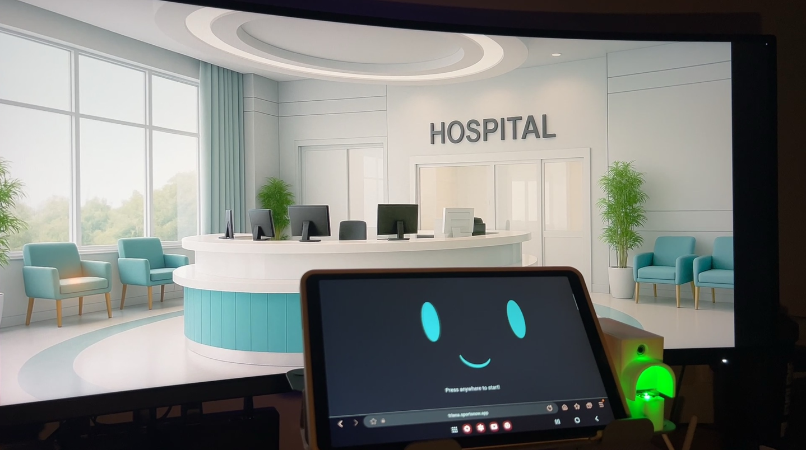

**Triana AI** is a smart Healthcare AIoT (Artificial Intelligence of Things) system that combines a computer and IoT sensors to collect patient data, assess health conditions through an AI chatbot, generate tailored reports for doctors and patients, and connect with hospital systems to **front-desk operations**, **streamline AI diagnosis**, and **specialist assignment**.


You can visit out app in [here](https://triana.sportsnow.app) (https://triana.sportsnow.app)

## 📱 Features

- 🟢 **Splash Screen**: Animated robot face introduces the app.
- 🧾 **Identity Form**: Entry point for users to input identity before entering queue.
- 📞 **Chat View**: Real-time session-based chat with the assistant.
- 🩺 **Doctor Home View**: Dashboard for doctors to manage and monitor queue.
- 💊 **Doctor Diagnosis View**: View and update diagnosis for each patient session.
- ⚙️ **Bluetooth Config View**: Configurations for Bluetooth hardware.

---

## 🚀 Getting Started

### Prerequisites
- Flutter SDK (3.x recommended)
- Dart SDK
- A device/emulator to run the app

### Installation

```bash
git clone https://github.com/TrianaAI/triana-web.git
cd triana-web
flutter pub get
flutter run
```

---

## 📲 App Flow

### 🟢 Splash Screen — `/`

* The app starts with an animated splash screen showing **Triana**, a friendly robot face.
* 👉 Tap **anywhere** on the screen to continue.

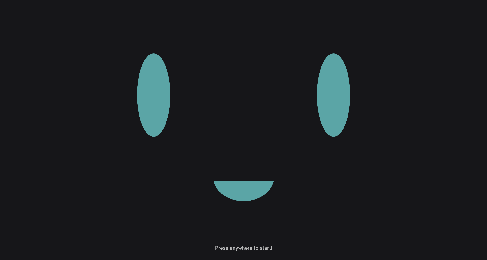

---

### 🧾 Identity Form — `/front_counter/`

* You're prompted to enter personal data:

  * Like Nationality, weight, and height.
  * Manual input for **heart rate** and **body temperature** if hardware is not available.

* Once the form is submitted, you'll be asked to enter a **One-Time Password (OTP)** sent to your email.

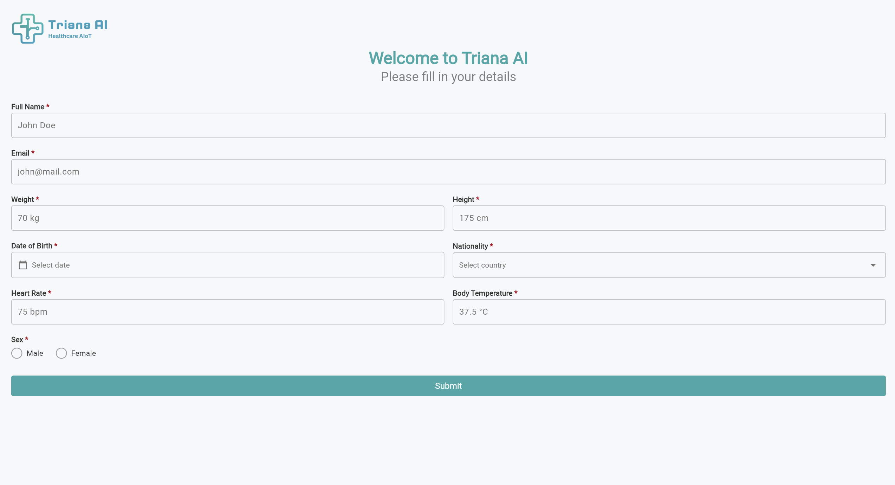

---

### 🔐 OTP Verification

* Enter the OTP from your email to proceed.
* If the OTP is **correct**, you're redirected to the chat screen.

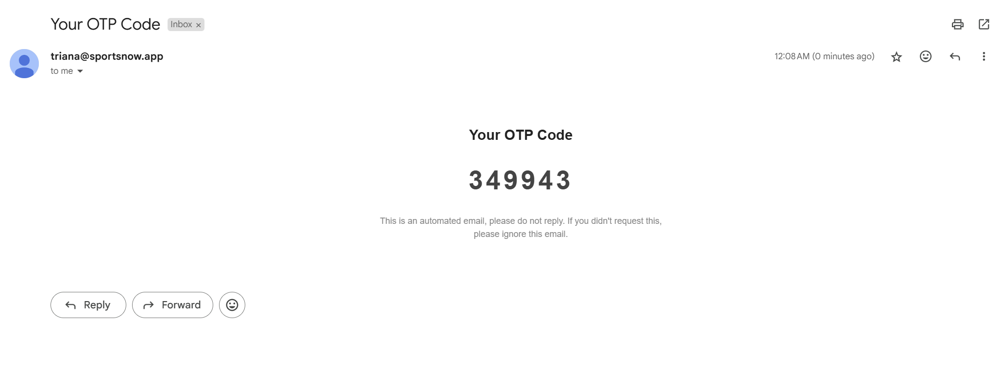

---

### 📶 Bluetooth Config View -`/front_counter/config`
* If you were to have the hardware, you can go to the **Bluetooth Config View** to connect to the hardware.

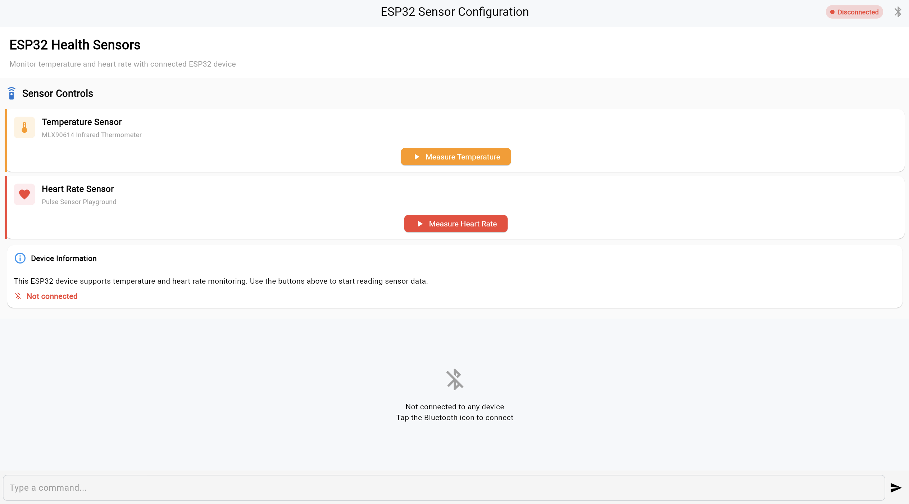

---

### 💬 Chat with Triana — `/front_counter/chat/:session`

* Triana asks about your symptoms in a natural conversational format.
* Based on your responses and submitted data, Triana:

  * Performs a **preliminary diagnosis**.
  * Books an appointment with an available doctor.

  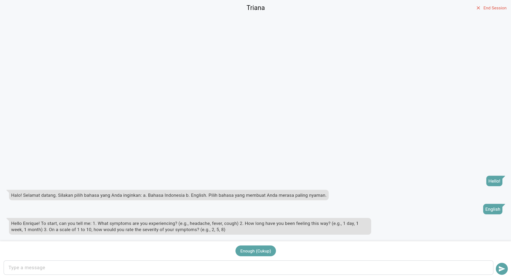

* You'll receive:

  * A **queue number**
  * The **doctor’s name**
  * The **room assignment**
  * These details are also sent to your **email**.

  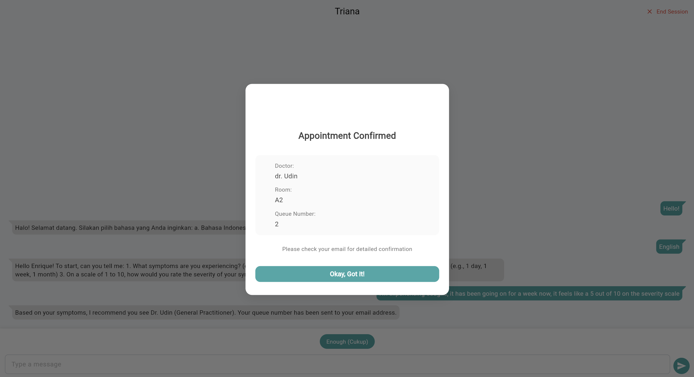

  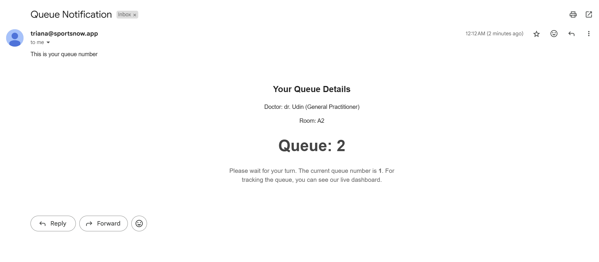

---

### 🧑‍⚕️ Doctor Dashboard — `/doctor/:id`

* Simulates a **doctor’s view** in the system.

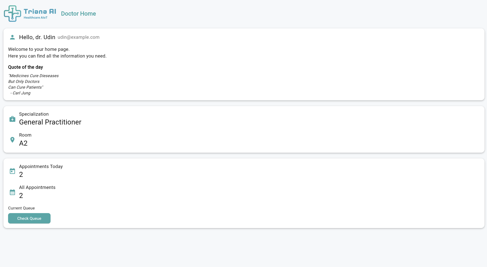

* If there's an active appointment, a button will appear at the bottom, clicking it will show the current queue/appointment.

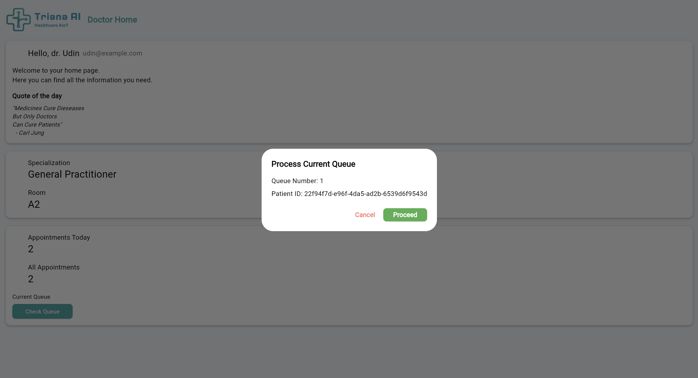

---

### 📝 Doctor Diagnosis — `/doctor/diagnosis/:id`

* After selecting a patient, the doctor sees:

  * Form-submitted data
  * Triana's pre-diagnosis
  * Patient’s **past appointment history**
* The doctor can:

  * Input their own diagnosis
  * Finish the appointment by clicking **Finish Appointment**
* The app then proceeds to the **next patient**, if available.

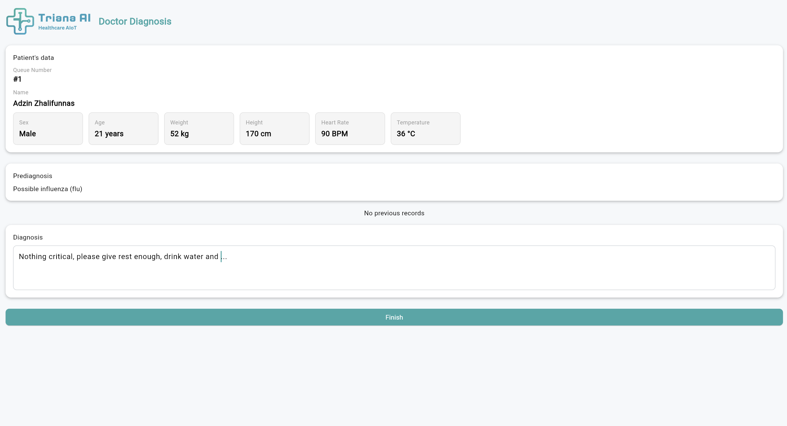

---

## 📌 Notes

* For development/testing, you can manually input data instead of relying on connected devices.
* Email verification (OTP) and appointment details are handled via backend services.

---

## Doctor List
Here are the available doctors in our database. [id] - [doctor name] - [specialty] - [room]:
- f186afd5-a175-420e-b06e-d35a713d3616 - Dr. Udin - General Practitioner - A2
- edd248b7-75d3-4af2-a954-183970124e9d - Dr. Jane Doe - Cardiologist - A1
